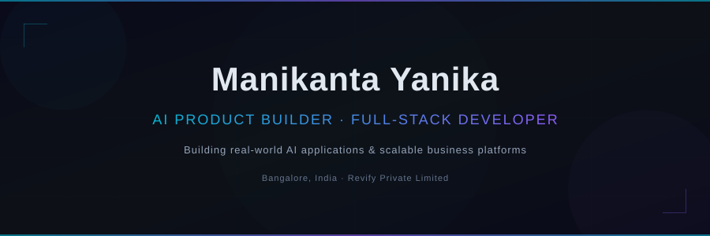

<div align="center">

<!-- HERO BANNER -->


<br/>
<br/>

### Hi, I'm Manikanta Yanika 👋

**AI Product Builder | Full-Stack Developer**

Building real-world AI applications, intelligent workflow automation systems,<br/>and scalable business platforms.

<br/>

📍 Bangalore, India &nbsp;·&nbsp; 🏢 Revify Private Limited

<br/>

[](https://revifyearth.com)&nbsp;&nbsp;
[](https://github.com/ManikantaYanika)

</div>

---

<br/>

## About Me

I build products at the intersection of **AI and full-stack engineering** — from intelligent applications powered by LLMs to complete business platforms that solve real problems. My work spans AI product development, workflow automation, and sustainability technology through [Revify Private Limited](https://revifyearth.com).

<br/>

## What I Build

<table>
<tr>
<td width="50%" valign="top">

### 🤖 &nbsp;AI Products
AI-powered applications and intelligent workflows — leveraging LLMs, RAG, and prompt engineering to build tools that deliver real value.

</td>
<td width="50%" valign="top">

### ⚙️ &nbsp;Automation
Workflow automation and productivity systems that eliminate repetitive work and streamline operations.

</td>
</tr>
<tr>
<td width="50%" valign="top">

### 💻 &nbsp;Full-Stack Products
Modern web applications and business platforms built with TypeScript, React, and scalable architectures.

</td>
<td width="50%" valign="top">

### 🌱 &nbsp;Sustainability Technology
ESG reporting, BRSR, GRI, and digital sustainability experiences through RevifyEarth.

</td>
</tr>
</table>

<br/>

## Tech Stack

<div align="center">

| Frontend | Backend | Database | Cloud & DevOps | AI |
|:---:|:---:|:---:|:---:|:---:|
|  |  |  |  |  |
|  |  |  |  |  |
|  |  |  |  |  |
|  |  | |  | |
|  | | |  | |
|  | | | | |

</div>

<br/>

## Featured Projects

<table>
<tr>
<td width="50%" valign="top">

### 🌱 &nbsp;RevifyEarth ESG Hub
ESG and sustainability reporting platform with digital report experiences.

**Stack:** TypeScript<br/>
**Repo:** [RevifyEarth-ESG-Hub](https://github.com/ManikantaYanika/RevifyEarth-ESG-Hub)<br/>
**Web:** [revifyearth.com](https://revifyearth.com)

- ESG / BRSR / GRI reporting workflows
- Digital sustainability experiences

</td>
<td width="50%" valign="top">

### 📊 &nbsp;Sagility ESG Report Experience
Interactive ESG sustainability report experience prototype inspired by Sagility's FY2024-25 Sustainability Report.

**Stack:** TypeScript<br/>
**Repo:** [sagility-esg-report-experience](https://github.com/ManikantaYanika/sagility-esg-report-experience)<br/>
**Live:** [sagility-esg-report-experience.vercel.app](https://sagility-esg-report-experience.vercel.app)

- Enterprise-grade interactive report
- Live deployment on Vercel

</td>
</tr>
<tr>
<td width="50%" valign="top">

### 🌐 &nbsp;Satsang Translator Pro
Translation tool built with TypeScript.

**Stack:** TypeScript<br/>
**Repo:** [satsang-translator-pro](https://github.com/ManikantaYanika/satsang-translator-pro)

</td>
<td width="50%" valign="top">

### 🤖 &nbsp;ManiEcho Bot
Bot application built with TypeScript.

**Stack:** TypeScript<br/>
**Repo:** [ManiEcho_bot](https://github.com/ManikantaYanika/ManiEcho_bot)

</td>
</tr>
<tr>
<td width="50%" valign="top">

### 🧠 &nbsp;Learn Tune Deploy
Learning, fine-tuning, and deployment toolkit built with TypeScript.

**Stack:** TypeScript<br/>
**Repo:** [learn-tune-deploy](https://github.com/ManikantaYanika/learn-tune-deploy)

</td>
<td width="50%" valign="top">

### 🎮 &nbsp;Flappy Bird Clone
Browser-based game clone built with JavaScript.

**Stack:** JavaScript<br/>
**Repo:** [Flappy-Bird-Clone](https://github.com/ManikantaYanika/Flappy-Bird-Clone)

</td>
</tr>
</table>

<br/>

## 🌱 &nbsp;RevifyEarth

<div align="center">

**ESG & Sustainability Reporting · Communication · Digital Experiences**

</div>

<br/>

[RevifyEarth](https://revifyearth.com) is an ESG and sustainability reporting and communication company under **Revify Private Limited**. We work across:

- **ESG Reporting** — sustainability report design and production
- **BRSR & GRI** — framework-aligned reporting and gap assessment
- **Sustainability Communication** — stakeholder-facing ESG narratives
- **Digital Experiences** — interactive digital sustainability reports

<br/>

<div align="center">

[](https://revifyearth.com)

</div>

<br/>

## Current Focus

```
🤖  AI product development & LLM applications
🔧  Full-stack engineering with TypeScript & React
🔄  Intelligent workflow automation
📊  RAG and retrieval-augmented systems
🌱  ESG & sustainability technology
🏗️  Scalable product architecture
```

<br/>

## GitHub

<div align="center">

[](https://github.com/ManikantaYanika)

<br/>


<br/>


</div>

<br/>

## Development Philosophy

```
→  Build real products, not toy demos
→  Solve real problems with working software
→  Keep systems maintainable and well-structured
→  Automate the repetitive, focus on the creative
→  Learn by shipping
→  Use AI as a tool, responsibly
```

<br/>

---

<div align="center">

<br/>

### Let's build something meaningful.

<br/>

[](https://revifyearth.com)&nbsp;&nbsp;
[](https://github.com/ManikantaYanika)

<br/>

<sub>Built with purpose. Powered by curiosity.</sub>

</div>
