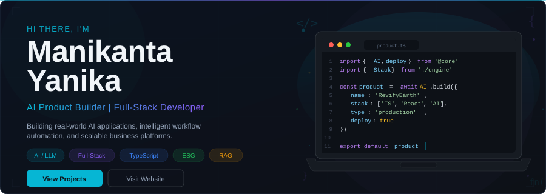
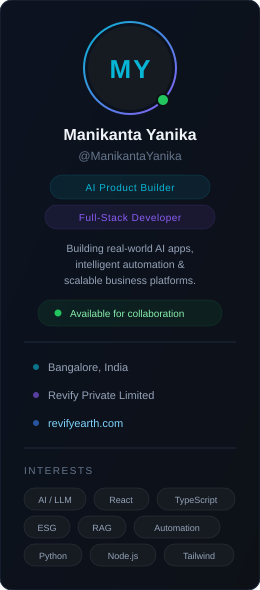
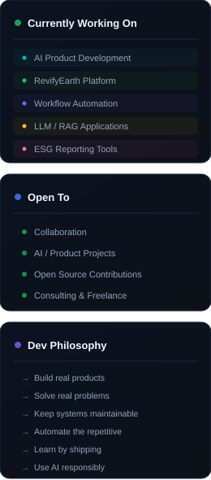

<!-- ═══════════════════════════════════════════════════════════════ -->
<!-- MANIKANTA YANIKA — DEVELOPER DASHBOARD                        -->
<!-- ═══════════════════════════════════════════════════════════════ -->

<!-- HERO BANNER -->

 

<!-- STATS ROW -->

&nbsp;
&nbsp;
&nbsp;
&nbsp;

 

<!-- ═══════════════════════════════════════════════════════════════ -->
<!-- DASHBOARD LAYOUT: LEFT SIDEBAR | MAIN CONTENT | RIGHT SIDEBAR -->
<!-- ═══════════════════════════════════════════════════════════════ -->

<table>
<tr>

<!-- ══════════ LEFT SIDEBAR ══════════ -->
<td width="24%" valign="top">

 
 

&nbsp;

</td>

<!-- ══════════ MAIN CONTENT ══════════ -->
<td width="52%" valign="top">

<!-- TECH STACK -->

### &#9881;&#65039; Tech Stack

**Frontend**

&nbsp;
&nbsp;
&nbsp;
&nbsp;
&nbsp;
&nbsp;

**Backend**

&nbsp;
&nbsp;
&nbsp;

**Database & Cloud**

&nbsp;
&nbsp;
&nbsp;
&nbsp;

**AI**

&nbsp;
&nbsp;

---

<!-- FEATURED PROJECTS -->

### &#128293; Featured Projects

**&#127793; RevifyEarth ESG Hub**
ESG and sustainability reporting platform with digital report experiences.
`TypeScript` &nbsp; [Repo](https://github.com/ManikantaYanika/RevifyEarth-ESG-Hub) · [Web](https://revifyearth.com)

**&#128202; Sagility ESG Report**
Interactive ESG sustainability report experience — enterprise-grade prototype.
`TypeScript` &nbsp; [Repo](https://github.com/ManikantaYanika/sagility-esg-report-experience) · [Live](https://sagility-esg-report-experience.vercel.app)

**&#127760; Satsang Translator Pro**
Translation tool built with TypeScript.
`TypeScript` &nbsp; [Repo](https://github.com/ManikantaYanika/satsang-translator-pro)

**&#129302; ManiEcho Bot**
Bot application built with TypeScript.
`TypeScript` &nbsp; [Repo](https://github.com/ManikantaYanika/ManiEcho_bot)

**&#129504; Learn Tune Deploy**
Learning, fine-tuning, and deployment toolkit.
`TypeScript` &nbsp; [Repo](https://github.com/ManikantaYanika/learn-tune-deploy)

---

<!-- REVIFYEARTH -->

### &#127793; RevifyEarth

[RevifyEarth](https://revifyearth.com) is an ESG and sustainability reporting and communication company under **Revify Private Limited**.

&#8226; ESG Reporting &nbsp; &#8226; BRSR & GRI &nbsp; &#8226; Sustainability Communication &nbsp; &#8226; Digital Report Experiences

---

<!-- GITHUB ACTIVITY -->

### &#128200; GitHub Activity

</td>

<!-- ══════════ RIGHT SIDEBAR ══════════ -->
<td width="24%" valign="top">

</td>

</tr>
</table>

<!-- ═══════════════════════════════════════════════════════════════ -->
<!-- FOOTER                                                         -->
<!-- ═══════════════════════════════════════════════════════════════ -->

 

---

 

**Let's build something meaningful.**

 

&nbsp;&nbsp;

 

Built with purpose. Powered by curiosity.

